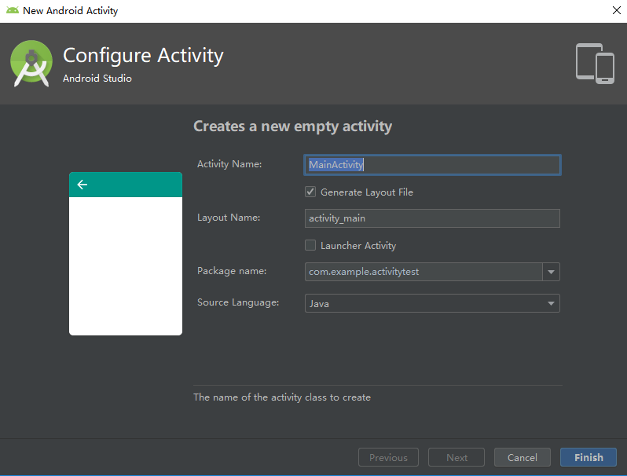

# 探究活动

## 手动创建活动

右击com.example.activitytest包->New->Activity->Empty Activity弹出活动对话框

勾选Generate Layout File表示会自动为MainActivity创建一个对应的布局文件，勾选Launcher Activity标识自动讲MainActivity设置为当前项目著活动

```java
package com.example.activitytest;

import androidx.appcompat.app.AppCompatActivity;

import android.os.Bundle;

public class SecondActivity extends AppCompatActivity {

    @Override
    protected void onCreate(Bundle savedInstanceState) {
        super.onCreate(savedInstanceState);
        setContentView(R.layout.second_layout);
    }
}
```

setContentView()方法给当前的活动加载一个布局，而在setContentView()，一般会传入一个布局文件的id，项目中添加的任何资源都会在R文件中生成一个相应的资源id，只需要调用R.layout.second_layout就可以得到second_layout.xml布局的id。

所有活动要在AndroidManifest.xml中注册才能生效。Android studio可以自动创建

需要配置主活动，要不然程序不知道先启动哪个，在对应<activity>标签中加入

```xml
<intent-filter>
	<action android:name="android.intent.action.MAIN" />

	<category android:name="android.intent.category.LAUNCHER" />
</intent-filter>
```

## 在活动中使用toast

```java
@Override
protected void onCreate(Bundle savedInstanceState) {
    super.onCreate(savedInstanceState);
    setContentView(R.layout.first_layout);
    Button button1 = findViewById(R.id.button_1);
    button1.setOnClickListener(new View.OnClickListener() {
        @Override
        public void onClick(View view) {
	   Toast.makeText(FirstActivit.this, "You clicked Button 1", Toast.LENGTH_SHORT).show();
        }
    });

}
```
第一个参数是Context，也就是Toast要求的上下文，由于活动本身就是一个Context对象，因此这里直接传入FirstActivit.this即可，第二个参数是Toast显示的文本内容，第三个参数是Toast显示的时长

## 在活动中使用Menu

在res目录下新建一个menu文件夹，右击res目录->New->Directory,输入文件名menu，接着在这个文件夹下在新建个名叫main的菜单文件，右击menu文件夹->New->Menu resource file


```xml
<menu xmlns:android="http://schemas.android.com/apk/res/android">
    <item
        android:id="@+id/add_item"
        android:title="Add"/>
    <item
        android:id="@+id/remove_item"
        android:title="Romove"/>
</menu>
```

```java
    public boolean onCreateOptionsMenu(Menu menu) {
        getMenuInflater().inflate(R.menu.main, menu); // 当前活动创建菜单，第一个参数用于指定我们通过哪一个资源文件创建菜单，第二个参数用于指定我们的菜单项将添加到哪一个Menu对象中
        return true;
    }

    public boolean onOptionsItemSelected(MenuItem item) {  // 响应事件
        switch (item.getItemId()) {
            case R.id.add_item:
                Toast.makeText(this, "You clicked add", Toast.LENGTH_SHORT).show();
                break;
            case R.id.remove_item:
                Toast.makeText(this, "you clicked Remove", Toast.LENGTH_SHORT).show();
                break;
            default:
        }
        return true;
    }
```

## 销毁活动

   `finish()`

## 使用Intent在活动之间穿梭

Intent是Android程序中各组件之间进行交互的一种重要方式，它不仅能指明当前组件想要执行的动作，还可以在不同组件之间传递数据。Intent一般可被用于启动活动，启动服务以及发送广播等场景。
1.使用显示Intent

Intent有多个构造函数重载，其中一个是Intent(Context packageContext, Class<?>cls).第一个参数context要求提供一个启动活动的上下文，第二个参数Class则是指定想要启动的目标活动，通过这个构造函数可以构建出Intent的意图，Activity类中提供了一个startActivity方法，这个方法是专门用于启动活动的

```java
    @Override
    protected void onCreate(Bundle savedInstanceState) {
        super.onCreate(savedInstanceState);
        setContentView(R.layout.first_layout);
        Button button1 = findViewById(R.id.button_1);
        button1.setOnClickListener(new View.OnClickListener() {
            @Override
            public void onClick(View view) {
                Intent intent = new Intent(FirstActivity.this, SecondActivity.class);
                startActivity(intent);
            }
        });

    }
```

## 使用隐式Intent

隐式Intent并不明确指出想要启动哪一个活动，而是指定了一系列更为抽象的action和category，然后交由系统分析，找出合适的活动去启动。
通过在<activity>标签下配置<intent-filter>内容，可以指定活动能够响应的action和category，打开AndroidManifest.xml,添加如下代码

```xml
<activity android:name=".SecondActivity">
    <intent-filter>
        <action android:name="com.example.activitytest.ACTION_START" />
        <action android:name="com.example.category.DEFAULT" />
    </intent-filter>
</activity>
```

```java
        button1.setOnClickListener(new View.OnClickListener() {
            @Override
            public void onClick(View view) {
                Intent intent = new Intent(com.example.activitytest.ACTION_START);
                startActivity(intent);
            }
        });
```

com.example.category.DEFAULT是一种默认的category，在调用startActivity方法的时候会自动将category添加到Intent中。使用intent.addCategory()增加category

## 向下一个活动传递数据

intent.putExtra()
取数据
intent.getStringExtra(),getIntExtra();getBooleanExtra()

## 返回数据给上一个活动

Activity中还有一个startActivityForResult()方法用于启动活动的，但这个方法期望在活动销毁的时候能够返回一个结果给上一个活动。

startActivityForResult()接受两个参数，第一个还是Intent，第二个参数是请求码，用于在之后的回调中判断数据来源。

FirstActivity中按钮的点击事件：

```java
        button1.setOnClickListener(new View.OnClickListener() {
            @Override
            public void onClick(View view) {
                Intent intent = new Intent(FirstActivity.this, SecondActivity.class);
                startActivityForResult(intent, 1);  // 请求码只要是唯一值就可以
            }
        });
```

SecondActivity中给按钮注册点击时间，并在点击事件中添加返回数据的逻辑：

```java
    @Override
    protected void onCreate(Bundle savedInstanceState) {
        super.onCreate(savedInstanceState);
        setContentView(R.layout.second_layout);
        Button button2 = findViewById(R.id.button_2);
        button2.setOnClickListener(new View.OnClickListener(){
            @Override
            public void onClick(View v) {
                Intent intent = new Intent();
                intent.putExtra("data_return", "Hello");
                setResult(RESULT_OK, intent);
                finish();
            }
        });
    }
```

构建了Intent，只是用于传递数据，setResult()用于向上一个活动返回数据，第一个参数用于向上一个活动返回处理结果，一般只使用RESULT_OK或RESULT_CANCELED这两个值。
由于我们是使用startActivityForResult方法启动SecondActivity的，在SecondActivity被销毁之后会回调上一个活动的onActivityResult():

```java
    @Override
    protected void onActivityResult(int requestCode, int resultCode, Intent data) {
        switch (requestCode) {
            case 1:
                if (resultCode == RESULT_OK) {
                    String returnedData = data.getStringExtra("data_return");
                    Log.d("FirstActivity", returnedData);
                }
        }
    }
```

requestCode:活动时传入的请求码，resultcode即我们在返回数据时传入的处理结果，data携带着返回数据的Intent。

如果时通过按下Back键回到FirstActivity.可以重写onBackPressed()方法来解决这个问题。

```java
    @Override
    public void onBackPressed() {
        Intent intent = new Intent();
        intent.putExtra("data_return", "FirstActivity");
        setResult(RESULT_OK, intent);
        finish();
    }
```

## 活动的生命周期

1. Android是使用任务（Task）来管理活动的，一个任务就是一组存放在栈里的活动的集合，这个栈也被称作返回栈（Back Stack）.在默认情况下，每当我们启动了一个新的活动，在会在返回栈中入栈，并处于栈顶的位置。每当我们按下Back键或调用finish()方法去销毁一个活动时，处于栈顶活动会出栈，这时前一个入栈的活动就会重新处于栈顶的位置。系统总是会显示处于栈顶的活动给用户。

2. 活动状态
- 运行状态
- 暂停状态
- 停止状态
- 销毁状态

3. 活动的生存期
- onCreate()
- onStart()
- onResume()
- onPause()
- onStop()
- onDestroy()
- onRestart()

以上7个方法除了onRestart()方法，其它都是两两相对的。从而又可以将活动分为3种生存期：
- 完整生存期
- 可见生存期
- 前台生存期


```java
public class MainActivity extends AppCompatActivity {
    private static final String TAG = "MainActivity";
    @Override
    protected void onCreate(Bundle savedInstanceState) {
        super.onCreate(savedInstanceState);
        setContentView(R.layout.activity_main);
        Button startNormalActivity = findViewById(R.id.start_normal_activity);
        Button startDialogActivity = findViewById(R.id.start_dialog_activity);
        startNormalActivity.setOnClickListener(new View.OnClickListener() {
            @Override
            public void onClick(View view) {
                Intent intent = new Intent(MainActivity.this, NormalActivity.class);
                startActivity(intent);
                Log.d(TAG, "onClick: first");
            }
        });
        startDialogActivity.setOnClickListener(new View.OnClickListener() {
            @Override
            public void onClick(View view) {
                Intent intent = new Intent(MainActivity.this, DialogActivity.class);
                startActivity(intent);
                Log.d(TAG, "onClick: onclick");
            }
        });
    }
    @Override
    protected void onStart() {
        super.onStart();
        Log.d(TAG, "onStart: onStart");
    }
    @Override
    protected void onResume() {
        super.onResume();
        Log.d(TAG, "onResume: onResume");
    }
    @Override
    protected void onPause() {
        super.onPause();
        Log.d(TAG, "onPause: onPause");
    }
    @Override
    protected void onStop() {
        super.onStop();
        Log.d(TAG, "onStop: onStop");
    }
    @Override
    protected  void onDestroy() {
        super.onDestroy();
        Log.d(TAG, "onDestory: onDestory");

    }
    @Override
    protected void onRestart() {
        super.onRestart();
        Log.d(TAG, "onRestart: onRestart");
    }
}

```

5. 活动被回收了怎么办

Activity中还提供了onSaveInstanceState()回调方法，这个方法可以保证在活动被回收之前一定会被调用，因此我们可以通过这个方法解决活动被回收时临时数据得不到保存的问题。

## 链接

- [目录](directory.md)
- 上一部分：[日志](log.md)
