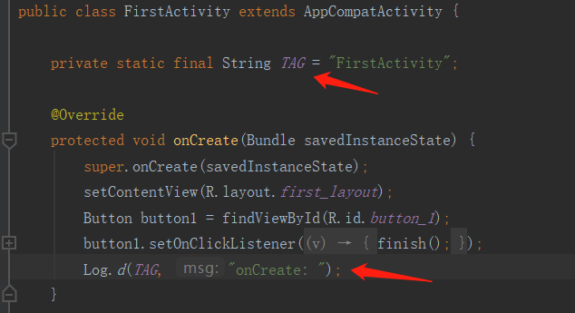

# 日志工具的使用

# Android的日志工具Log

- Log.v():用于打印那些最为琐碎的，意义最小的日志信息，对应级别verbose，是Android日志里面级别最低的一种
- Log.d():用于打印一些调试信息，这些信息对你调试程序和分析问题应该是有帮助的。对应级别是dubug，比verbose高一级
- Log.i():用于打印一些比较重要的数据，这些数据应该是你非常想看到的，可以帮你分析用户行为的数据。对应级别info，比debug高一级
- Log.w():用于打印一些警告信息，提示程序在这个地方可能会有潜在风险，最好去修复一下，对应级别warn，比info高一级
- Log.e():打印程序中的错误信息，比如程序进入到catch语句当中。对应级别error，比warn高一级

注：Android Studio快捷键：输入logd,然后按Tab键可以补全，依次类推.还有个小技巧，在onCreate()方法外面输入logt，按Tab，这时会以当前类名作为值自动生成一个TAG常量，如图：

## 链接

- [目录](directory.md)
- 上一部分：[Android简介](introduction.md)
- 下一部分：[探究活动](activity.md)
